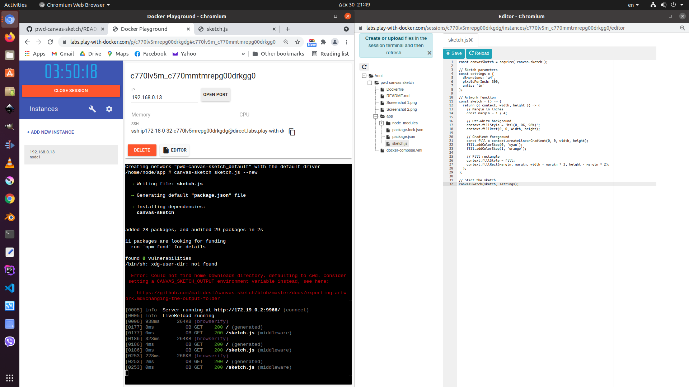
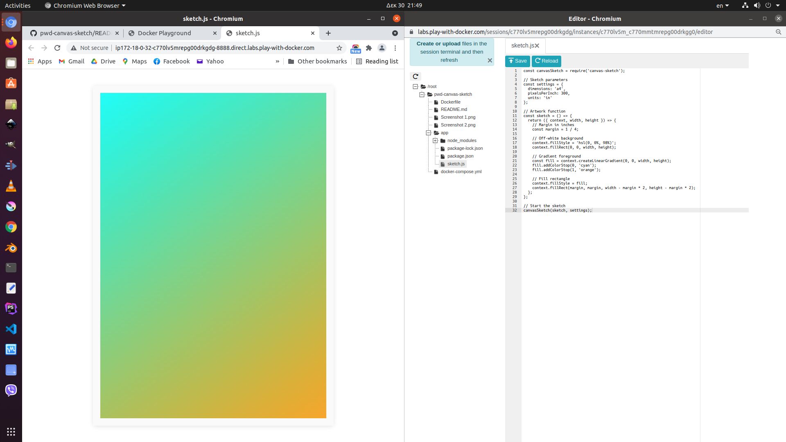

# pwd-canvas-sketch
This is a simple docker solution to experiment with canvas-sketch online in PWD (Play With Docker) Lab without installing node.js and canvas-sketch locally. Every session is kept alive for 4 hours, after that everything is deleted. If you want to save something copy/download before the end of the session. You can then upload a file in a new session by simply drag & drop in the PWD window or by creating a new file and copying/pasting the contents.

First, go to PWD Lab select [Login] > (docker) and [Start] to start a new session:
- https://labs.play-with-docker.com/

Select [+ADD NEW INSTANCE] and run the following commands on the command prompt (you can copy and then paste in the command line with the mouse middle button):
1. git clone https://github.com/isegkos/pwd-canvas-sketch.git
2. cd pwd-canvas-sketch
3. docker-compose build
4. docker-compose run --rm -p 8888:9966 node sh

Command [4] will take a minute, so please wait (do not mind the warnings). After command [5], you will get an environment where you can run canva-sketch commands, like:
- to create a new sketch:
  - canvas-sketch sketch.js --new 
- to open an existing sketch:
  - canvas-sketch sketch.js 

You can use the canvas-sketch-util library and the --output option in the commands. The ffmpeg is also installed in the environment. Whenever you want to stop working on a sketch and start/open another sketch, press CTRL+C and give the next canvas-sketch command. 

If you type exit and press ENTER you will leave the environment. If you want to start the environment again in the same PWD instance/session, run the following command again:
- docker-compose run --rm -p 8888:9966 node sh

Your sketches are located in the pwd-canvas-sketch/app directory. To edit your sketches in the online editor:
- click on [EDITOR]

To view your sketches in the browser:
- click on [OPEN PORT]
- enter 8888

or 
- click on the [8888] link if it becomes visible

### Notes:
- You cannot use the --out option which opens the sketch in the browser automatically, you have to open the sketch on your own, on [8888] port.
- When you create a new sketch with 'canvas-sketch sketch.js --new' and then add a library, like 'canvas-sketch-util/random', an error will appear saying the module cannot be found. That is because when the sketch was created, the library was not included in the node modules. Simply press CTRL+C and reopen as an existing sketch with 'canvas-sketch sketch.js' (without the --new option) and the library will be included. Reload or reopen the page with the sketch.
- You cannot directly download files from PWD Lab, but you can start a a web server on the background. Outside the canvas-sketch environment, give the following command to start a web server on port [4444]: 
- - docker run -dit --name httpd -p 4444:80 -v "$PWD":/usr/local/apache2/htdocs/ httpd:2.4
- - The web server runs on the background. You may re-enter the canvas-sketch environment with 'docker-compose run --rm -p 8888:9966 node sh'

### Screen shots:

